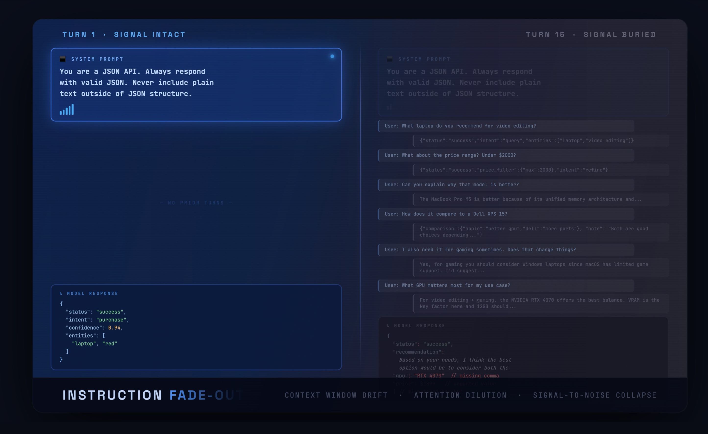

# Instruction Fade-Out

Demonstrating how LLM instruction compliance degrades over long conversations, and how event-driven system reminders recover it.



## The Problem

As conversations grow longer, LLMs progressively forget their system prompt instructions. The instructions are still in the context window — but their influence weakens with every turn. This is **instruction fade-out**.

## The Experiment

A single Python script runs 20 diverse questions through NVIDIA Nemotron 3 Super with a strict JSON format rule in the system prompt. It measures compliance turn-by-turn, then re-runs with event-driven system reminders injected every 3 turns.

### Results

| Condition | Compliance | First Violation |
|-----------|-----------|-----------------|
| Without reminders | 90% (18/20) | Turn 7 |
| With reminders | 95% (19/20) | Turn 19 |

```
Compliance by segment (without reminders):
  Turns 1-5:   █████ 5/5  (100%)
  Turns 6-10:  ████░ 4/5  (80%)
  Turns 11-15: ████░ 4/5  (80%)
  Turns 16-20: █████ 5/5  (100%)

Compliance by segment (with reminders):
  Turns 1-5:   █████ 5/5  (100%)
  Turns 6-10:  █████ 5/5  (100%)
  Turns 11-15: █████ 5/5  (100%)
  Turns 16-20: ████░ 4/5  (95%)
```

## Running

```bash
export NVIDIA_API_KEY="your-key"
pip install openai
python3 instruction-fadeout-demo.py
```

## Files

- `instruction-fadeout-demo.py` — The experiment
- `instruction-fadeout-blog.md` — Full blog post

## Credit

The concept of event-driven system reminders comes from "Building Effective AI Coding Agents for the Terminal" by Nghi D. Q. Bui (OpenDev, arXiv:2603.05344v2).

## Author

Cobus Greyling, Chief AI Evangelist @ Kore.ai
